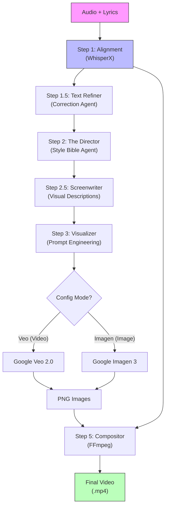

# 🎵 RhymeSync

**RhymeSync** is an agentic AI pipeline that transforms audio poems and lyrics into synchronized, aesthetically stunning 3D animated music videos.

It leverages a chain of specialized AI agents to analyze lyrics, direct visual style, write screenplays, and generate high-fidelity video assets using **Google Veo** (or Imagen 3), finally stitching everything together with frame-perfect synchronization using **WhisperX**.


## 🏗️ Architecture



## ✨ Key Features

- **🤖 Multi-Agent Chain**:
  - **Director**: Establishes a consistent "Style Bible" (e.g., Pixar, Cyberpunk, Watercolor).
  - **Screenwriter**: Translates poetic lyrics into concrete visual scene descriptions.
  - **Visualizer**: Optimizes prompts for specific generative models.
- **🎥 Google Veo Integration**: Generates consistent, high-fidelity 1080p vertical video clips (`veo-2.0-generate-001`).
- **🖼️ Imagen Support**: Fallback to static images with Ken Burns effects.
- **⚡ Perfect Sync**: Uses **WhisperX** for word-level alignment ensuring visuals hit exactly on the beat.
- **🚀 Production Ready**:
  - **CLI Overrides**: Switch inputs dynamically.
  - **Checkpointing**: Resume run from any step.
  - **Hindi Support**: Native rendering for complex scripts using `libraqm`.

## 🛠️ Installation

```bash
# Clone the repository
git clone https://github.com/mkstmp/RhymeSync.git
cd RhymeSync

# Install dependencies
pip install -r requirements.txt
```

> **Note**: Requires **FFmpeg** installed on your system path.

## 🚀 Usage

### 1. Basic Run
Set your API Key and run the default configuration:
```bash
export GEMINI_API_KEY="your_key_here"
python -m src.main --step all
```

### 2. Using Google Veo (Video Mode)
Enable Veo in `config.yaml` or use the flag overrides.
```yaml
# config.yaml
veo:
  enabled: true
  model: "veo-2.0-generate-001"
```

### 3. CLI Overrides (Switch Inputs Quickly)
You don't need to edit the config file for every poem. Just pass arguments:
```bash
python -m src.main --audio poems/lal_tamatar.wav --lyrics poems/lal_tamatar.txt --subject "Funny red tomato cartoon"
```

## 📂 Output
Results are organized by poem name and run ID:
```
output/
  └── lal_tamatar/
      └── 20251224_220000/
          ├── assets/           # Raw clips/images
          ├── lal_tamatar.mp4   # 🎬 Final Video
          └── run_config.yaml   # Reproducibility
```

## 📜 License
MIT
